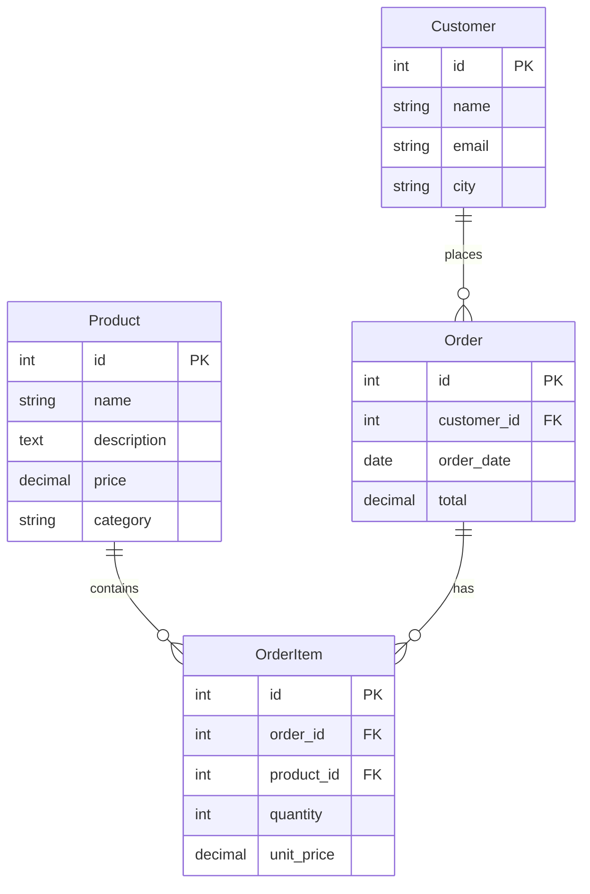

# System Architecture: SQL → Neo4j GraphRAG Pipeline

## 1. High-Level Architecture

```
┌─────────────────────────────────────────────────────────────────────┐
│                        CONTROL PLANE                                │
│  ┌──────────────┐  ┌──────────────┐  ┌──────────────┐  ┌─────────┐ │
│  │ etl_migrate  │  │create_vector │  │generate_emb  │  │ hybrid_ │ │
│  │    .py       │  │ _index.py    │  │  eddings.py  │  │query.py │ │
│  └──────┬───────┘  └──────┬───────┘  └──────┬───────┘  └────┬────┘ │
│         │                 │                 │               │      │
│         └─────────────────┴─────────────────┴───────────────┘      │
│                              │ ▲                                   │
│                    ┌─────────▼─┴──────────┐                        │
│                    │   Shared Utilities   │                        │
│                    │  ┌────────┐┌───────┐ │                        │
│                    │  │config  ││  db   │ │                        │
│                    │  │  .py   ││  .py  │ │                        │
│                    │  └────────┘└───────┘ │                        │
│                    │  ┌──────────────┐    │                        │
│                    │  │  embedder.py │    │                        │
│                    │  └──────────────┘    │                        │
│                    └──────────────────────┘                        │
└─────────────────────────────────────────────────────────────────────┘
                              │
                              ▼
┌─────────────────────────────────────────────────────────────────────┐
│                        DATA PLANE                                    │
│                                                                      │
│  ┌────────────┐     ┌──────────────────┐     ┌──────────────────┐   │
│  │   MySQL    │────►│      Neo4j       │────►│  Hybrid Query    │   │
│  │ (Source)   │ ETL │ 5.x + APOC       │     │  Result          │   │
│  │            │     │                  │     │                  │   │
│  │  products  │     │  ┌────────────┐  │     │  {               │   │
│  │  customers │     │  │ Graph Nodes │  │     │    seed_id,      │   │
│  │  orders    │     │  │ + Vector    │  │     │    seed_name,    │   │
│  │  order_    │     │  │   Index     │  │     │    score,        │   │
│  │   items    │     │  └────────────┘  │     │    connected_    │   │
│  │            │     │                  │     │      entities    │   │
│  └────────────┘     └──────────────────┘     │  }               │   │
│                            ▲                 └──────────────────┘   │
│                            │                                         │
│                    ┌───────┴────────┐                                │
│                    │   Embedding    │                                │
│                    │   Provider     │                                │
│                    │  ┌──────────┐  │                                │
│                    │  │ OpenAI   │  │                                │
│                    │  │ or Local │  │                                │
│                    │  └──────────┘  │                                │
│                    └────────────────┘                                │
└─────────────────────────────────────────────────────────────────────┘
```

## 2. Data Flow

### 2.1 End-to-End Pipeline

```
MySQL Tables ──► Neo4j Nodes ──► Vector Index ──► Embeddings ──► Hybrid Search
     │                │               │                │                │
     │ Step 1         │ Step 2        │ Step 3         │ Step 4         │ Step 5
     ▼                ▼               ▼                ▼                ▼
 discover_tables  migrate_table()  create_vector   generate_       hybrid_search(
     │           MERGE nodes     _index()        embeddings()      user_query)
     │           with :Label     vector index    READ nodes       │
     ▼                               on :Label    embed text      ▼
 discover_foreign_keys()             +embedding   SET n.embedding Vector search
     │                               property     = vector         on index
     ▼                                                              │
 migrate_relationships()                                     Graph traversal
 MATCH (child)-[:REL]->(parent)                             on seed nodes
                                                                     │
                                                                     ▼
                                                             Enriched results
                                                             (seed + neighbors)
```

### 2.2 Data Transformation

| SQL Table     | Neo4j Label  | Primary Key → Node Property | FK → Relationship                                                                                  |
| ------------- | ------------ | --------------------------- | -------------------------------------------------------------------------------------------------- |
| `products`    | `:Product`   | `id` → `n.id`               | —                                                                                                  |
| `customers`   | `:Customer`  | `id` → `n.id`               | —                                                                                                  |
| `orders`      | `:Order`     | `id` → `n.id`               | `customer_id` → `-[:BELONGS_TO_CUSTOMER]->(:Customer)`                                             |
| `order_items` | `:OrderItem` | `id` → `n.id`               | `order_id` → `-[:BELONGS_TO_ORDER]->(:Order)`, `product_id` → `-[:BELONGS_TO_PRODUCT]->(:Product)` |

## 3. Component Descriptions

### 3.1 Shared Utilities Layer

| Module        | Responsibility                                                                                    | Key Interfaces                                                                                                |
| ------------- | ------------------------------------------------------------------------------------------------- | ------------------------------------------------------------------------------------------------------------- |
| `config.py`   | Single-source-of-truth for all environment configuration. Loads `.env` via `python-dotenv`.       | `NEO4J_URI`, `MYSQL_HOST`, `EMBEDDING_PROVIDER`, `EMBEDDING_DIMENSIONS`, `TOP_K`, `mysql_connection_string()` |
| `db.py`       | Factory functions for database connections. Encapsulates driver/connection creation and teardown. | `get_neo4j_driver() → neo4j.Driver`, `get_mysql_connection() → pymysql.Connection`                            |
| `embedder.py` | Embedding abstraction layer. Dispatches to the configured provider with lazy-loaded clients.      | `get_embedding(text: str) → list[float]`                                                                      |

### 3.2 Pipeline Scripts

| Script                   | Phase | Input                            | Output                                   | Side Effects                                              |
| ------------------------ | ----- | -------------------------------- | ---------------------------------------- | --------------------------------------------------------- |
| `etl_migrate.py`         | 2     | MySQL database                   | Neo4j nodes + relationships              | Writes nodes via `MERGE`, creates relationships           |
| `create_vector_index.py` | 3.1   | Neo4j credentials                | Neo4j vector index                       | Drops existing index then creates new one                 |
| `generate_embeddings.py` | 3.2   | Neo4j nodes with text properties | Same nodes with `embedding` property set | Reads text → calls `get_embedding()` → writes vector back |
| `hybrid_query.py`        | 4     | User query string                | JSON result set                          | Read-only (no mutations)                                  |

### 3.3 Infrastructure

| Component      | Technology                | Purpose                                           |
| -------------- | ------------------------- | ------------------------------------------------- |
| Graph Database | Neo4j 5.x                 | Stores nodes, relationships, and vector indexes   |
| APOC Plugin    | `neo4j:5` with APOC       | Provides utility procedures (JDBC import, etc.)   |
| Vector Index   | Neo4j native vector index | Enables approximate nearest-neighbor (ANN) search |
| MySQL          | External source           | Relational source database                        |
| Docker Compose | Container orchestration   | Manages Neo4j lifecycle                           |

## 4. Embedding Architecture

### 4.1 Provider Selection

The system supports two embedding providers, configured via `EMBEDDING_PROVIDER`:

```
┌────────────────────────────────────────────────────┐
│                  embedder.get_embedding(text)       │
│                          │                          │
│            EMBEDDING_PROVIDER value                 │
│                │                 │                  │
│           "openai"           "local"                │
│                ▼                 ▼                  │
│  ┌─────────────────┐   ┌─────────────────────┐     │
│  │ OpenAI client    │   │ SentenceTransformer │     │
│  │ text-embedding-  │   │ all-MiniLM-L6-v2   │     │
│  │ 3-small          │   │ (384d)             │     │
│  │ (1536d)          │   │                     │     │
│  └─────────────────┘   └─────────────────────┘     │
│                │                 │                  │
│                └────────┬────────┘                  │
│                         ▼                           │
│                  list[float]                        │
└────────────────────────────────────────────────────┘
```

### 4.2 Dimension Matching

The vector index dimensions **must** match the embedding model output:

| Provider | Model                    | Dimensions | Index `dimensions` |
| -------- | ------------------------ | ---------- | ------------------ |
| OpenAI   | `text-embedding-3-small` | 1536       | `1536`             |
| Local    | `all-MiniLM-L6-v2`       | 384        | `384`              |

> **⚠️ Important:** If you switch providers after creating the vector index, you must drop and recreate the index with the correct dimensions. The `create_vector_index.py` script drops any existing index with the same name before creating, making it safe to re-run.

### 4.3 Lazy Initialization

Both embedding clients use lazy initialization (initialized on first call, not on import). This avoids:

- Loading the `sentence-transformers` model (~90 MB) when using OpenAI
- Requiring an `OPENAI_API_KEY` when using the local provider
- Import-time failures from missing dependencies

## 5. Hybrid Query Architecture

### 5.1 Query Flow

```
User Query: "affordable wireless headphones"
                    │
                    ▼
          ┌─────────────────┐
          │  embedder.      │
          │  get_embedding()│ ───► [0.023, -0.456, ..., 0.891] (1536d)
          └─────────────────┘
                    │
                    ▼
          ┌──────────────────────────────┐
          │  Cypher: SEARCH + MATCH      │
          │                              │
          │  MATCH (seed:Product)        │
          │    SEARCH seed IN (          │
          │      VECTOR INDEX            │
          │      vector_index            │
          │      FOR $embedding          │
          │      LIMIT 5                 │
          │    ) SCORE AS score          │
          │                              │
          │  OPTIONAL MATCH              │
          │    (seed)-[r]-(connected)    │
          │                              │
          │  RETURN seed, score,         │
          │    collect(connected) AS ctx │
          └──────────────────────────────┘
                    │
                    ▼
          ┌──────────────────────────────────────┐
          │  Result:                              │
          │  [                                    │
          │    { seed_id: 1,                      │
          │      seed_name: "Wireless BT Head...",│
          │      score: 0.89,                     │
          │      connected_entities: [            │
          │        { entity: "...",               │
          │          label: ["Order"],             │
          │          relationship: "BELONGS_TO_..."│
          │        }                              │
          │      ]                                │
          │    },                                 │
          │    ...                                 │
          │  ]                                    │
          └──────────────────────────────────────┘
```

### 5.2 Fallback Mechanism

The query script attempts Neo4j 5.x's `SEARCH` clause first. If that fails (e.g., older Neo4j version), it falls back to the `db.index.vector.queryNodes()` procedure:

```
Attempt: MATCH ... SEARCH ... VECTOR INDEX ...
    │
    ├── Success ──► Return results
    │
    └── Exception ──► CALL db.index.vector.queryNodes('vector_index', ...)
                        │
                        └──► Return results
```

### 5.3 Result Enrichment

Each vector match (`seed`) is enriched with its graph neighborhood via `OPTIONAL MATCH (seed)-[r]-(connected)`. This produces a **context window** around each semantically relevant node, enabling GraphRAG-style queries where the answer considers both the matched entity and its relationships.

## 6. ETL Architecture

### 6.1 Table Discovery

```
mysql> SELECT table_name FROM information_schema.tables
       WHERE table_schema = 'graphrag_demo'
       AND table_type = 'BASE TABLE';

  Result: ["products", "customers", "orders", "order_items"]
```

### 6.2 Foreign Key Discovery

```
mysql> SELECT kcu.table_name, kcu.column_name,
              kcu.referenced_table_name, kcu.referenced_column_name
       FROM information_schema.key_column_usage kcu
       WHERE kcu.table_schema = 'graphrag_demo'
       AND kcu.referenced_table_name IS NOT NULL;

  Result:
    orders      | customer_id | customers   | id
    order_items | order_id    | orders      | id
    order_items | product_id  | products    | id
```

### 6.3 Label Mapping

Plural SQL table names are mapped to singular Neo4j labels via `_table_label()`:

| SQL Table     | Neo4j Label          |
| ------------- | -------------------- |
| `products`    | `:Product`           |
| `customers`   | `:Customer`          |
| `orders`      | `:Order`             |
| `order_items` | `:OrderItem`         |
| _(any other)_ | `table_name.title()` |

### 6.4 Node Creation

Each row becomes a Neo4j node using `MERGE` keyed on `id`. The `id` column is extracted from properties and used as the merge key, while all other columns (except `created_at`) become node properties.

```
SQL Row:
  id=1, name="Wireless Bluetooth Headphones",
  description="Noise-cancelling...", price=89.99,
  category="Electronics"

Neo4j Node:
  (:Product {id: 1, name: "...", description: "...",
             price: 89.99, category: "Electronics"})
```

### 6.5 Relationship Creation

Foreign keys are translated to directed relationships. The relationship type follows the pattern `BELONGS_TO_{PARENT_LABEL}`:

```
Foreign Key: orders.customer_id → customers.id

  MATCH (child:Order {customer_id: ...})
  MATCH (parent:Customer {id: ...})
  MERGE (child)-[:BELONGS_TO_CUSTOMER]->(parent)
```

## 7. Configuration & Environment

### 7.1 Configuration Loading Chain

```
.env.example          # Template with defaults and comments
      │
      ▼  (cp .env.example .env)
.env                  # Actual config (gitignored)
      │
      ▼  (python-dotenv)
os.environ            # Environment variables
      │
      ▼
config.py             # Typed Python module-level constants
      │
      ▼
scripts/*.py          # Imported via `from scripts import config`
```

### 7.2 Configuration Parameters

| Group     | Variable               | Type   | Default                    | Required             |
| --------- | ---------------------- | ------ | -------------------------- | -------------------- |
| Neo4j     | `NEO4J_URI`            | string | `bolt://localhost:7687`    | ✓                    |
|           | `NEO4J_USER`           | string | `neo4j`                    | ✓                    |
|           | `NEO4J_PASSWORD`       | string | `strong-password`          | ✓                    |
| MySQL     | `MYSQL_HOST`           | string | `localhost`                | ✓                    |
|           | `MYSQL_PORT`           | int    | `3306`                     |                      |
|           | `MYSQL_USER`           | string | `root`                     | ✓                    |
|           | `MYSQL_PASSWORD`       | string | `""`                       |                      |
|           | `MYSQL_DATABASE`       | string | `mydb`                     | ✓                    |
| Embedding | `EMBEDDING_PROVIDER`   | enum   | `"openai"`                 | ✓                    |
|           | `EMBEDDING_MODEL`      | string | `"text-embedding-3-small"` | ✓                    |
|           | `EMBEDDING_DIMENSIONS` | int    | `1536`                     | ✓                    |
| OpenAI    | `OPENAI_API_KEY`       | string | —                          | when provider=openai |
| Query     | `TOP_K`                | int    | `5`                        |                      |

## 8. Deployment Architecture

### 8.1 Docker Compose Topology

```
┌───────────────────────────────────┐
│         docker-compose.yml        │
│                                   │
│  ┌─────────────────────────────┐  │
│  │  neo4j:5                    │  │
│  │                             │  │
│  │  Ports:                     │  │
│  │    Host:7474 → :7474 (HTTP) │  │
│  │    Host:7687 → :7687 (Bolt) │  │
│  │                             │  │
│  │  Plugins: ["apoc"]          │  │
│  │                             │  │
│  │  Volumes:                   │  │
│  │    neo4j_data:/data         │  │
│  │    neo4j_logs:/logs         │  │
│  └─────────────────────────────┘  │
│                                   │
│  Volumes:                         │
│    neo4j_data (persistent)        │
│    neo4j_logs (persistent)        │
└───────────────────────────────────┘
```

### 8.2 Network Topology

```
┌──────────┐     bolt://localhost:7687     ┌──────────┐
│          │◄────────────────────────────►│          │
│  Python  │                               │  Neo4j   │
│  Scripts │     http://localhost:7474     │  Docker  │
│          │◄────────────────────────────►│  Container│
└──────────┘                               └──────────┘
      │
      │  mysql+pymysql://localhost:3306
      ▼
┌──────────┐
│  MySQL   │
│  (Host)  │
└──────────┘
```

All Python scripts run on the host machine, connecting to:

- **Neo4j** via Bolt protocol on port `7687` (mapped from container)
- **Neo4j Browser** via HTTP on port `7474`
- **MySQL** directly on the default port `3306`

## 9. Error Handling & Resilience

| Layer                        | Strategy                                                                            |
| ---------------------------- | ----------------------------------------------------------------------------------- |
| **DB connections**           | `try/finally` blocks ensure `driver.close()` and `mysql.close()` are always called  |
| **Embedding network errors** | Propagated as exceptions from OpenAI client; no retry logic (caller is responsible) |
| **SEARCH syntax**            | Fallback to `db.index.vector.queryNodes()` if the Cypher `SEARCH` clause fails      |
| **Index creation**           | `DROP INDEX ... IF EXISTS` before creating, making the script idempotent            |
| **Missing text property**    | Nodes with null/empty text are silently skipped during embedding generation         |
| **File I/O**                 | No file I/O in pipeline scripts — all state is in databases                         |

## 10. Sample Data Model

The included sample data represents a minimal e-commerce domain:



### 10.1 Neo4j Graph Representation

```
┌─────────────────────────────────────────────────┐
│                                                   │
│    (:Customer)                                    │
│        │                                           │
│        │ BELONGS_TO_CUSTOMER                       │
│        ▼                                           │
│    (:Order)                                        │
│        │                                           │
│        │ BELONGS_TO_ORDER                          │
│        ▼                                           │
│    (:OrderItem) ── BELONGS_TO_PRODUCT ──►(:Product)│
│                                                   │
│    (:Product)  ◄── vector index ── search         │
│                                                   │
└─────────────────────────────────────────────────┘
```

## 11. Extension Points

| Extension                         | How                                                                                       | Where                                                |
| --------------------------------- | ----------------------------------------------------------------------------------------- | ---------------------------------------------------- |
| **New SQL source** (PostgreSQL)   | Add `psycopg2` to `requirements.txt`; add `get_pg_connection()` to `db.py`                | `db.py`                                              |
| **New embedding provider**        | Add provider function in `embedder.py`; add config vars in `config.py` and `.env.example` | `embedder.py`, `config.py`                           |
| **Custom label mapping**          | Add entries to `_table_label()` overrides dict                                            | `etl_migrate.py`                                     |
| **Different similarity function** | Pass `--similarity euclidean` or `--similarity dot`                                       | `create_vector_index.py` CLI                         |
| **Batch embedding**               | Add `batch_embedding()` to `embedder.py` for parallel API calls                           | `embedder.py`                                        |
| **Cypher query customization**    | Modify the Cypher in `hybrid_search()` in `hybrid_query.py`                               | `hybrid_query.py`                                    |
| **LLM-powered answer generation** | Pass enriched results to an LLM (e.g., GPT-4) for a natural-language answer               | Separate script or integrated into `hybrid_query.py` |

## 12. Verification Checklist

```cypher
-- 1. Nodes exist
MATCH (n) RETURN labels(n) AS label, count(*) AS count;

-- 2. Relationships exist
MATCH ()-[r]->() RETURN type(r) AS rel_type, count(*) AS count;

-- 3. Vector index exists
SHOW INDEXES;

-- 4. Embeddings populated
MATCH (n:Product) WHERE n.embedding IS NOT NULL
RETURN count(*) AS embedded_count;

-- 5. Vector search works
WITH [0.01, -0.02, /* ...truncated... */] AS test_vector
CALL db.index.vector.queryNodes('vector_index', 5, test_vector)
YIELD node, score
RETURN node.name, score;
```
